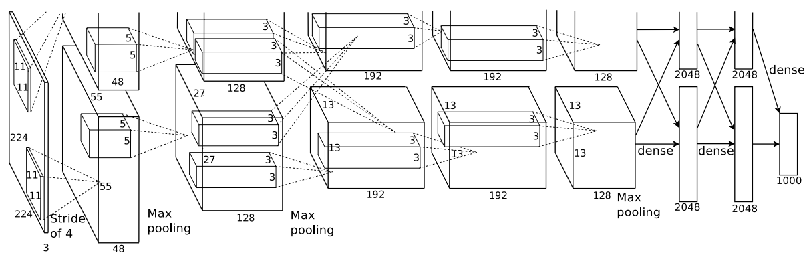

# AlexNet

- **AlexNet网络结构：**

  Conv11 -> Conv5 -> MaxPool -> Conv3 -> MaxPool -> Conv3 -> Conv3 -> Conv3 -> MaxPool -> Dropout(0.5) -> FC-2048 -> Dropout(0.5) -> FC-2048 -> FC-1000

- **AlexNet输入图像尺寸为：** 

  3 x 224 x 224

- **AlexNet输出为：** 

  1000个类别的概率

- **AlexNet亮点：**

  1. 首次利用GPU进行网络加速训练。
  2. 使用ReLU激活函数，而不是传统的Sigmoid激活函数或者Tanh激活函数。
  3. 使用LRN(Local Response Normalization)局部响应归一化。
  4. 在前两层全连接层中使用Dropout随机失活神经元操作，以减少过拟合。