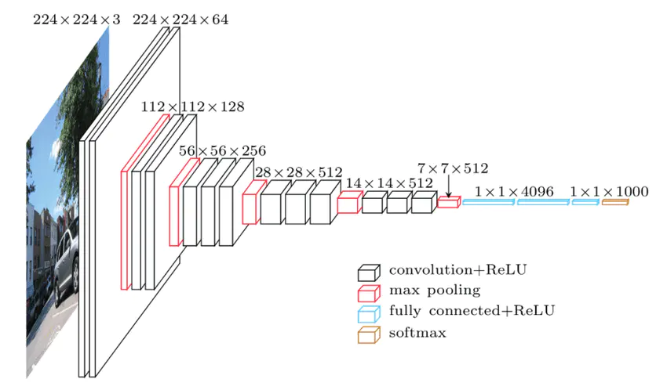
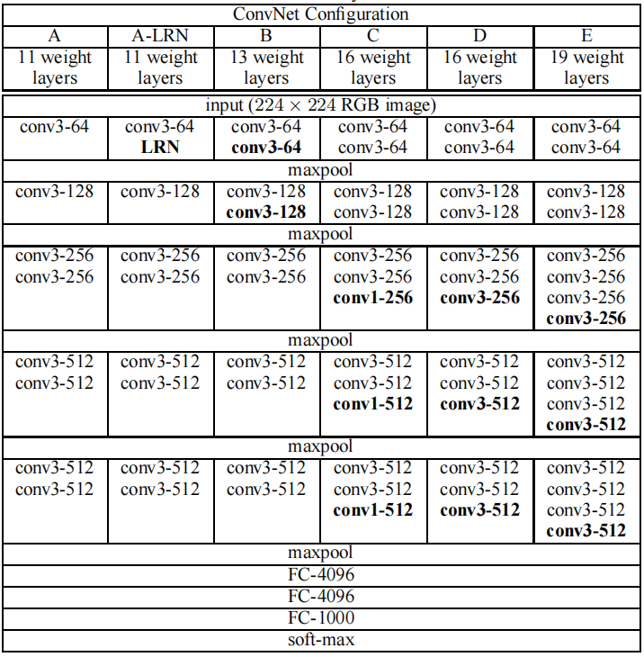

# VGGNet





- **VGGNet网络结构（以D配置为例）：**

  ```shell
  Conv3 -> Conv3 -> MaxPool
  -> Conv3 -> Conv3 -> MaxPool
  -> Conv3 -> Conv3 -> Conv3 -> MaxPool
  -> Conv3 -> Conv3 -> Conv3 -> MaxPool
  -> Conv3 -> Conv3 -> Conv3 -> MaxPool
  -> FC-4096 -> Dropout(0.5) -> FC-4096 -> Dropout(0.5) -> FC-1000 -> Softmax
  ```

- **VGGNet输入图像尺寸为：** 

  3 x 224 x 224

- **VGGNet输出为：** 

  1000个类别的概率

- **VGGNet亮点：**

  1. 通过堆叠多个3x3的卷积核来替代大尺度的卷积核，以减少需要计算的参数量（原理是它们拥有相同的感受野(receptive field)：两个3x3的卷积核替代5x5的卷积核，三个3x3的卷积核替代7x7的卷积核）。
