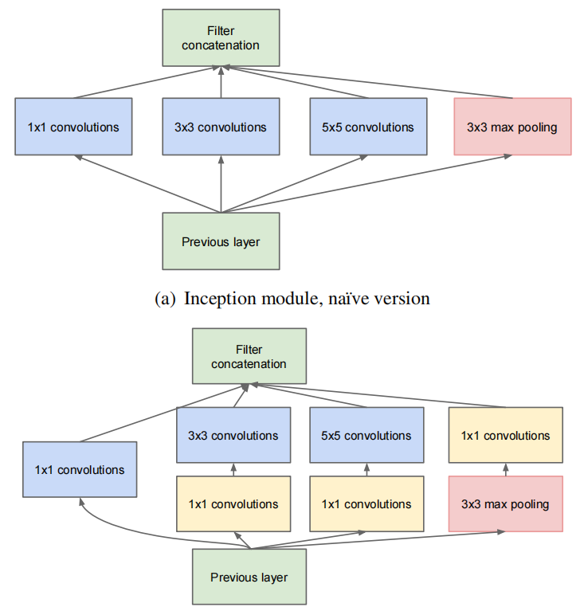
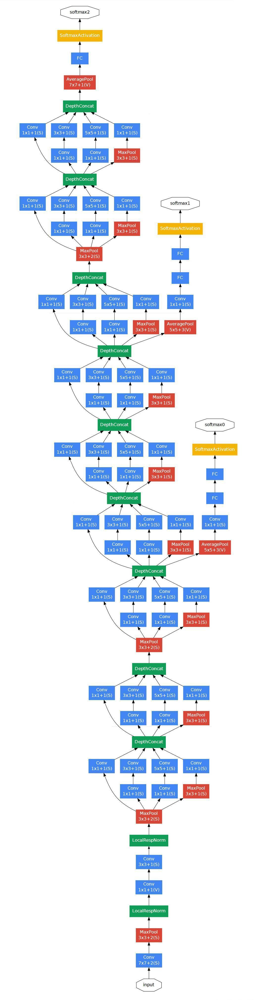

# GoogLeNet

- **Inception Module：**

  

- **GoogLeNet：**

  

- **GoogLeNet Architecture：**

  

- **GoogLeNet网络结构：**
  
    ```shell
    Conv7 -> MaxPool -> LRN
    -> Conv1 -> Conv3 -> LRN -> MaxPool
    -> Inception(3a) -> Inception(3b) -> MaxPool
    -> Inception(4a) -> Inception(4b) & Aux(1)
    -> Inception(4c) -> Inception(4d) -> Inception(4e) & Aux(2) -> MaxPool
    -> Inception(5a) -> Inception(5b)
    -> AvgPool -> Dropout(0.4) -> FC-1024 -> Softmax-1000
  ```
  
- **GoogLeNet输入图像尺寸为：** 

  3 x 224 x 224

- **GoogLeNet输出为：** 

  1000个类别的概率

- **GoogLeNet亮点：**

  1. 引入`Inception`结构，融合不同尺度的特征信息。
  2. 使用 1x1 的卷积核进行降维处理以及映射处理。
  3. 添加两个辅助分类器帮助训练。
  4. 丢弃全连接层，使用平均池化层，大大减少了模型参数量。
